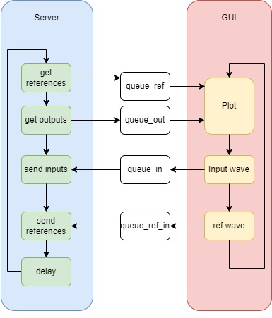
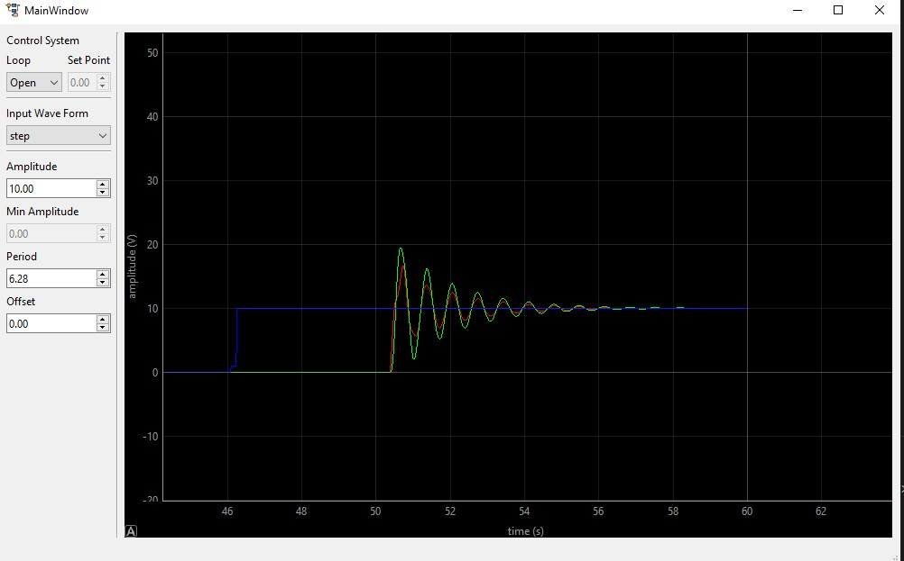
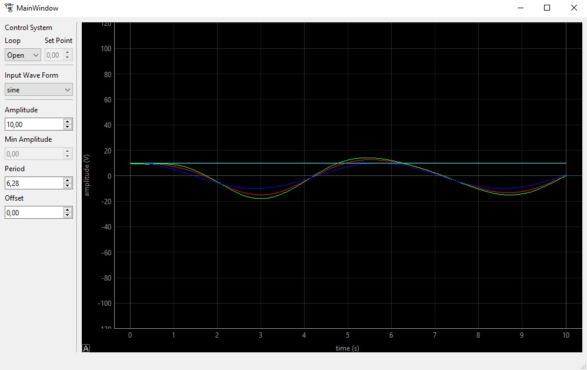
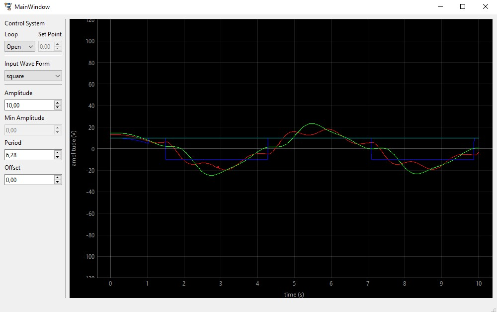
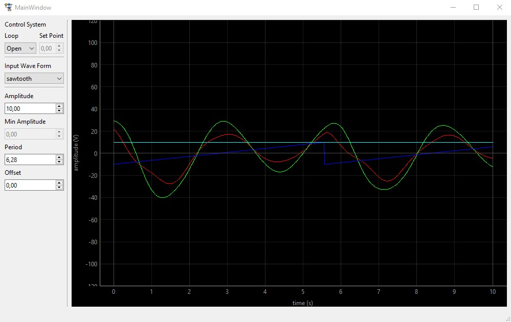
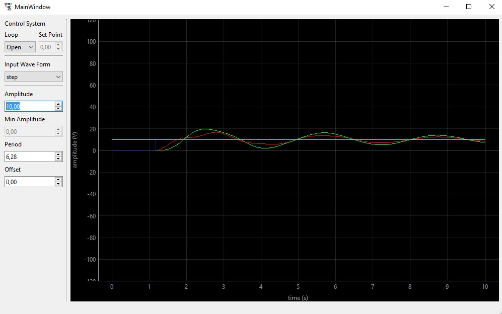

# Introdução

Segundo [Nise, 2017](https://www.amazon.com.br/Engenharia-Sistemas-Controle-Norman-Nise/dp/8521634358/ref=sr_1_1?qid=1650079914&refinements=p_27%3ANorman+S.+Nise&s=books&sr=1-1&ufe=app_do%3Aamzn1.fos.db68964d-7c0e-4bb2-a95c-e5cb9e32eb12),
um sistema de controle consiste em um conjunto de subsistemas e processos 
(ou plantas) com o propósito de se obter uma saída especificada, dado uma 
entrada especificada.

Dito posto, o mesmo autor ressalta que esse conceito se faz muito presente no 
dia a dia. Tendo seu estudo uma grande importância.

Como o controle de sistemas reais exige uma estrutura considerável. O uso de 
simuladores é uma excelente alternativa para fins acadêmicos e de projeto.

O simulador [iDynamic](https://www.dev-mind.blog/control-systems-virtual-lab/)
desenvolvido pela UFRN é bastante completo. Contando com simulação gráfica,
interativa, 2D, 3D e com vários exemplos de sistemas diferentes. Pecando
apenas na documentação rasa.

Contudo, sua principal funcionalidade é a possibilidade do usuário inserir o 
próprio controlador no sistema.

# Objetivo

Esse projeto se trata de uma aplicação em que é possível trocar dados com o
iDynamic, com a possibilidade de se inserir várias curvas de entrada e plotar
as saídas do simulador. Concentrando-se no exemplo de massa-mola complexo.

# Comunicação

O iDynamic foi desenhado para funcionar com [websockets](https://websockets.readthedocs.io/en/stable/).
Isto é, uma comunicação TCP-IP, onde a aplicação é o servidor e o cliente é o 
próprio simulador.

Baseado nisso, a primeira comunicação foi feita através do [exemplo](mycontroller.py) dado na documentação do iDynamic.
Contudo, por comodidade, tentou-se estabelecer uma comunicação através de
[socket](https://docs.python.org/3/library/socket.html). Já que na conversação
TCP-IP pouco importaria se seria utilizado websockets ou socket. 

Entretanto, o iDynamic se mostrou apenas compatível com o websockets, encerrando
qualquer comunicação via socket rapidamente. Portanto, adaptou-se um servidor 
websockets a arquitetura do projeto.

# Arquitetura

O projeto é estruturado com [threading](https://docs.python.org/3/library/threading.html). Uma thread faz a comunicação com o iDynamic e outra controla
a interface gráfica. Essa escolha foi tomada devido ao delay que seria demasiado
no caso de um processamento single thread.

Como o websockets é baseado em [asyncio](https://docs.python.org/3/library/asyncio.html) que é uma biblioteca pensada em processos concorrentes em single thread, sua implementação com múltiplas threads foi um tanto custosa.

Por fim, a comunicação com o iDynamic foi feita com websockets, rodando na thread
principal. Uma thread secundária roda a interface gráfica. A comunicação entre 
as duas threads é feita através de [queues](https://docs.python.org/3/library/queue.html).

Mais detalhes da arquitetura na imagem a seguir:



# Interface gráfica

A interface gráfica foi desenvolvia com [PyQt6](https://wiki.python.org/moin/PyQt), baseando-se no [tutorial](https://www.pythonguis.com/pyqt6-tutorial/).
Já os gráficos foram desenvolvidos com [PyQtGraph](https://www.pyqtgraph.org/),
baseando-se no [passo-a-passo](https://www.pythonguis.com/tutorials/plotting-pyqtgraph/).

# Setup inicial

```console
$ python3 -m venv env
$ source env/bin/activate
$ pip install -r requeriments.txt
```

# Rodar o servidor
```console
$ python3 test.py
```
Em seguida, abra o [simulador](https://dev-mind.blog/apps/control_systems/iDynamic/system6.html). Clique em *Control* e em *Play*.

Selecione a forma de onda de entrada e altere a amplitude.



# Resultados

## Loop Aberto

### Seno



### Onda Quadrada



### Dente de Serra



### Step

